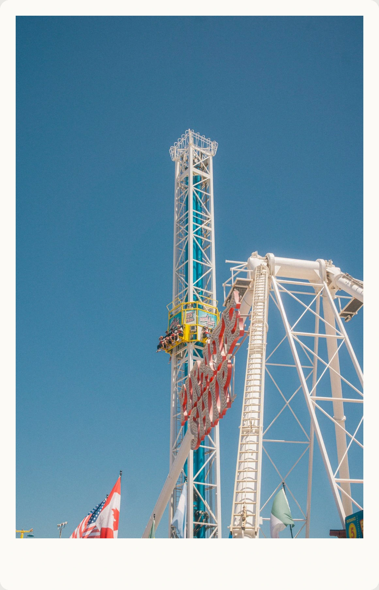

# Hey hey
### I'm Kevin, a creative technologist & growth engineer wannabe

<table>
<tr>
<td width="62%" valign="middle">

🎓&nbsp; UC Davis CS '27 &nbsp;•&nbsp; Creative Technologist &nbsp;•&nbsp; Growth Engineer
 
🌱&nbsp; Growth loops &nbsp;•&nbsp; Forward-deployed engineering &nbsp;•&nbsp; Automation & dashboards
 
📷&nbsp; Photography & videography &nbsp;•&nbsp; Story-driven vlogging
 
🧑‍💼&nbsp; Co-President @ CASA, UC Davis &nbsp;•&nbsp; Building with DecodeNeuro
 
🎮&nbsp; Keyboards & PC building &nbsp;•&nbsp; Speedcubing &nbsp;•&nbsp; Games & Anime

  

</td>
<td width="38%" align="center">

</td>
</tr>
</table>
